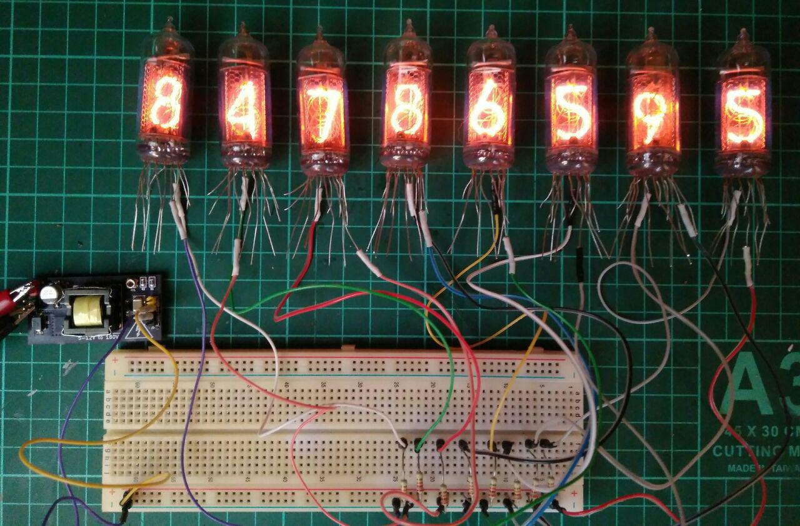
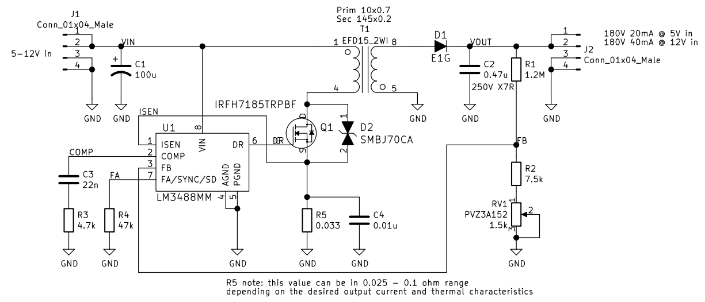
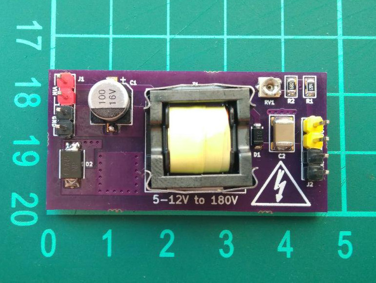
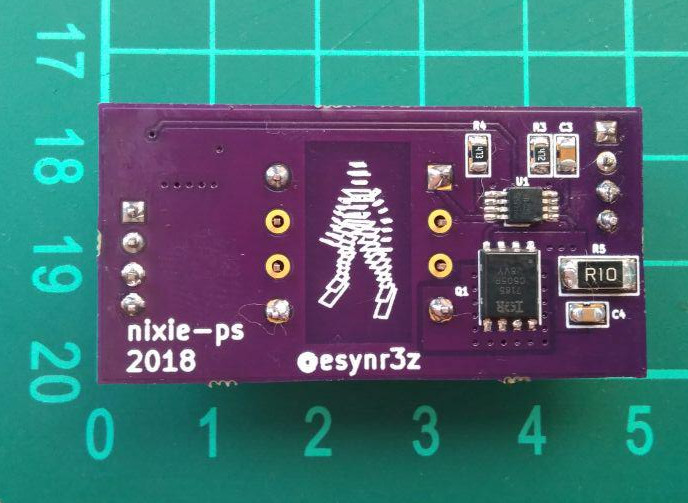
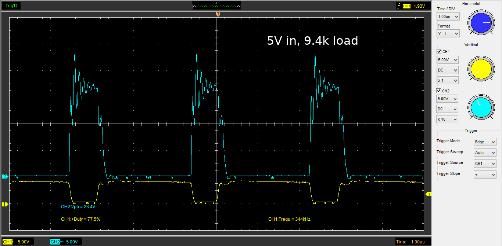
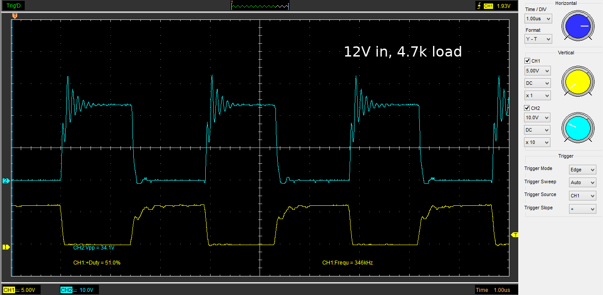

# Nixie power supply

## Features

High voltage flyback converter for nixie tubes

* Input voltage: 5V - 12V
* Output voltage: 150V - 200V
* Output power: 180V 20mA @ 5V in, 180V 40mA @ 12V in

## Board

Schematic and pcb layout created in KiCad 6 Nightly Build (compatible with KiCad 5). Converter also have been simulated with LTspice XVII.

[Order board v1.0 from OSH Park](https://oshpark.com/shared_projects/xFiD4IsX)

## Testing

### 5V input

Drain and gate oscillograms:

Measured characteristics:

| Vin, V | Iin, mA | Pin, W |  Rload, kOhm | Vout, V | Iout, mA | Pout, W | Eff, % |
|-------:|--------:|-------:|-------------:|--------:|---------:|--------:|-------:|
|   5,34 |     82  |   0,44 |           NC |   180,7 |        - |       - |      - |
|   5,21 |    278  |   1,45 |         37,6 |   180,4 |      4,6 |    0,83 |  57,29 |
|   5,16 |    374  |   1,93 |         28,2 |   180,2 |      6,3 |    1,14 |  58,83 |
|   5,07 |    549  |   2,78 |         18,8 |   180,0 |      9,5 |    1,71 |  61,43 |
|   4,92 |    730  |   3,59 |         14,1 |   179,9 |     12,7 |    2,28 |  63,61 |
|   4,61 |   1170  |   5,39 |          9,4 |   179,5 |     19,2 |    3,45 |  63,90 |

### 12V input

Drain and gate oscillograms:

Measured characteristics:

| Vin, V | Iin, mA | Pin, W |  Rload, kOhm | Vout, V | Iout, mA | Pout, W | Eff, % |
|-------:|--------:|-------:|-------------:|--------:|---------:|--------:|-------:|
|  12,52 |      17 |   0,21 |           NC |   180,4 |        - |       - |      - |
|  12,39 |     195 |   2,42 |         37,6 |   177,9 |      4,4 |    0,78 |  32,40 |
|  12,38 |     217 |   2,69 |         28,2 |   177,8 |      6,0 |    1,07 |  39,71 |
|  12,36 |     249 |   3,08 |         18,8 |   177,6 |      9,2 |    1,63 |  53,09 |
|  12,32 |     273 |   3,36 |         14,1 |   177,6 |     12,3 |    2,18 |  64,95 |
|  12,28 |     326 |   4,00 |          9,4 |   177,9 |     18,9 |    3,36 |  83,99 |
|  12,00 |     789 |   9,47 |          4,7 |   176,7 |     38,1 |    6,73 |  71,11 |

## Notes

* Output current limit can configured with R5 resistor. Less value - more current, but also more heating. With values <0.025 ohm converter may become unstable.
* D1 diode should be replaced with bigger one for operating with maximum current at 12V. Current SOD-123FL diode can be easily thermal destroyed in this mode.

## To do ...

* Improve mosfet layout for better heat dissipation
* Replace one shunt resistor (this values are rare) with 2-3 more generic nominals connected in parallel
* Add test points for drain and gate nets for debugging purpose
* More current, less temperature, more effeciency and etc.
